# Administrative Documentation

This directory contains architectural analysis and strategic documentation for the Agentic RPG Simulator project and its broader implications for intelligent operations platform design.

## Documents

### [Architecture Guide](./architecture.md)
**Comprehensive technical analysis of the Agentic RPG Simulator architecture**

Detailed documentation of the RPG simulator's sophisticated agentic workflow patterns, including:
- Event processing engine with 7-step execution protocol
- Character subagent system with bidirectional synchronization
- Token economy design and budget enforcement
- State management architecture and data flows
- Schema-driven validation and prompt automation
- Real-world implementation patterns and file organization

This guide serves as both technical documentation for understanding the system's current architecture and a reference for implementing similar agentic narrative generation systems.

### [Intelligent Operations Platform](./intelligent-operations-platform.md)
**Foundational white paper on deterministic vs non-deterministic system architecture**

Core architectural concepts for designing intelligent operations platforms that effectively balance computational efficiency with creative intelligence:
- Fundamental separation of deterministic and non-deterministic processing
- Communication protocols (MCP, A2A, gRPC) for different system types
- Goroutine-based session management patterns
- Provider abstraction for intelligence, storage, and monitoring services
- Agent lifecycle management and hybrid format strategies
- Cloud provider integration for enterprise deployments

This document establishes the theoretical framework and practical patterns for building scalable, cost-effective intelligent systems.

### [Case Study: Non-Deterministic Systems](./case-study_non-deterministic-systems.md)
**Analysis of the RPG simulator as a purely non-deterministic system with optimization recommendations**

Practical application of the intelligent operations platform framework, demonstrating:
- Current implementation analysis (100% non-deterministic operations)
- Token consumption patterns and cost implications
- Strategic separation opportunities for 50-60% cost reduction
- MCP server architecture design for deterministic operations
- Migration strategy with clear ROI and implementation phases
- Broader implications for intelligent operations platform development

This case study provides concrete evidence for the value of deterministic/non-deterministic separation and serves as a template for optimizing similar agentic systems.

## Document Relationships

```mermaid
graph TD
    A[Intelligent Operations Platform] --> B[Architecture Guide]
    A --> C[Case Study: Non-Deterministic Systems]
    B --> C
    
    A["🎯 Theoretical Framework<br/>Deterministic vs Non-Deterministic<br/>Processing Patterns"]
    B["🏗️ Concrete Implementation<br/>RPG Simulator Architecture<br/>Agentic Workflow Patterns"]
    C["📊 Optimization Analysis<br/>Current State Assessment<br/>Strategic Recommendations"]
```

## Key Insights

### From Theory to Practice
The **Intelligent Operations Platform** document establishes the theoretical framework for separating deterministic and non-deterministic operations. The **Architecture Guide** demonstrates how sophisticated agentic systems can be built using purely non-deterministic approaches. The **Case Study** then applies the theoretical framework to analyze the practical system, revealing significant optimization opportunities.

### Cost-Effectiveness of Intelligent Systems
The analysis reveals that well-designed separation of concerns can reduce operational costs by 50-60% while improving reliability and creative quality. This demonstrates that intelligent operations platforms can achieve both computational efficiency and creative intelligence when architected appropriately.

### Migration Strategies
The case study provides a concrete roadmap for evolving from prototyping-focused (maximally flexible) architectures to production-optimized (strategically efficient) implementations, with clear ROI calculations and incremental implementation phases.

### Broader Applicability
These patterns extend beyond RPG simulation to any complex agentic system that combines routine operations with creative intelligence, including:
- Content generation platforms
- Automated analysis systems
- Intelligent process automation
- Creative workflow tools
- Decision support systems

## Usage Guidelines

### For System Architects
1. Start with the **Intelligent Operations Platform** to understand core architectural principles
2. Review the **Architecture Guide** to see sophisticated agentic patterns in practice
3. Use the **Case Study** as a template for analyzing and optimizing existing agentic systems

### For Developers
1. The **Architecture Guide** provides detailed implementation patterns for agentic workflows
2. The **Case Study** demonstrates concrete optimization techniques and their impact
3. The **Intelligent Operations Platform** offers design principles for new system development

### For Product Managers
1. The **Case Study** provides clear cost-benefit analysis for architectural optimization
2. The **Intelligent Operations Platform** establishes criteria for technology selection
3. The **Architecture Guide** demonstrates the capabilities possible with agentic systems

## Contributing

When adding new documentation to this directory:
- Follow the established pattern of combining theoretical frameworks with practical analysis
- Include concrete examples and implementation details
- Provide clear cost-benefit analysis where applicable
- Reference relationships between documents to maintain coherent narrative

This documentation set serves as both a technical reference and a strategic guide for developing intelligent operations platforms that balance computational efficiency with creative intelligence.