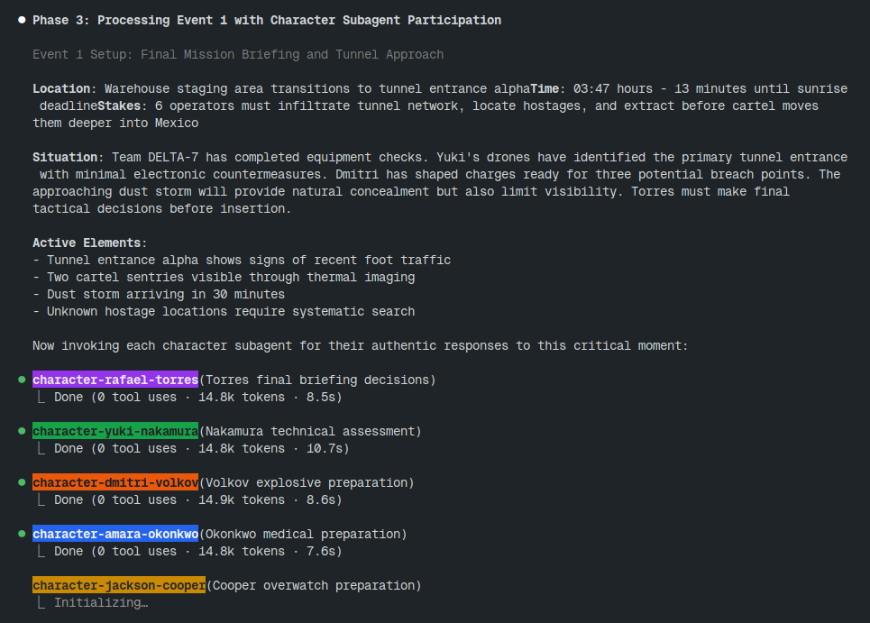

# Operational Simulator



This is an extension to the simulation infrastructure that I wanted to play Sunday morning. Capturing the details here for future reference. I'm imagining a scenario where we have a functional [intelligent-operations-platform](./intelligent-operations-platform.md) and we can conduct simulations with as much real-world data as possible, and being able to dynamically generate simulations from scenarios that can present many alternate paths and strategies.

## Planning

The following was executed in Plan Mode to establish:
- [`schemas/training-conditions.json`](../schemas/training-conditions.json)
- [`prompts/generate-training-scenario.md`](../prompts/generate-training-scenario.md)

### Initial Prompt

I would like to do something a little bit different today. Please read and review the architecture of this project as an agentic RPG simulator.

Particularly, dig into:
- README.md
- CLAUDE.md - the base engine directives for the main agent pipeline (you)
- .admin/architecture.md - it exists, it's just in a hidden directory so you will need to be aware of that.

What I would like to do is use the dynamic properties of this event-driven simulation to test out dynamically generated operational military training exercises.

I would like for you to generate a prompt within prompts/ that I can execute that will make you aware of this intent, and structure your scenario generation around optimizing for content that can be translated into training exercises.

Essentially, the prompt should be similar to prompts/generate-scenario.md, but instead of providing all of the parameters, The prompt is executed in one of the following ways:

Provide a set of conditions around which to build the scenario. Set the parameters for the scenario based on the conditions provided to ensure a compelling training scenario.

```
Prompt: prompts/generate-training-scenario.md
Conditions: [a description of conditions to build the scenario around]
```

Or, simply execute the prompt. When executed in this manner, it should trigger to the agent that the user would like to brainstorm setting the conditions for the scenario. In this case, the prompt should be set to ensure inverse prompting is used to gather the details of the conditions from the user. Establish a standardized set of parameters that are critical for generating a compelling scenario, and ask for these parameters along with helpful examples that will help the user generate an effective training scenario.

```
Prompt: prompts/generate-training-scenario.md
```

This training scenario can then be fed into the adventure simulator to evalute the sequence of events, and training events can be created to align with the most compelling ideas from the simulation.

Can you think of any other useful considerations to ensure this prompt can be executed successfully? Ultrathink.

## Strategy

Thank you for the clarification. I now understand that you want to leverage theexisting RPG simulator architecture to generate scenarios that, while played out as narrative adventures, can yield insights applicable to military training exercises. The simulator remains unchanged - we're simply creating a specialized prompt that generates scenarios optimized for training value.

Let me analyze the key considerations for this approach:

Key Insights from the Architecture

1. Event-Driven Structure: Each scenario unfolds through discrete events with
compressed state handoffs, perfect for simulating decision points in training
exercises.
2. Token Economy: Forces concise, impactful decisions - mirroring real-world
operational constraints where time and resources are limited.
3. Character Autonomy: The subagent system creates authentic behavioral responses,
allowing realistic simulation of team dynamics and individual decision-making under
stress.
4. Complexity Scaling: Low/medium/high complexity events can map to different
training objectives and skill levels.
5. Evolution Tracking: Character growth and relationship changes model how teams
develop under pressure.

Considerations for Training-Oriented Scenarios

Scenario Parameters for Training Value

- Decision Points: Each event should present clear tactical/strategic choices
- Consequence Chains: Actions should have realistic ripple effects
- Team Dynamics: Multi-agent scenarios to explore leadership and coordination
- Resource Management: Token economy naturally enforces resource constraints
- Adaptability: Scenarios should test response to changing conditions

Useful Mapping Concepts

- RPG "combat mechanics" → Tactical decision-making
- "Social mechanics" → Negotiation, diplomacy, information gathering
- "Exploration mechanics" → Reconnaissance, intelligence analysis
- Character relationships → Team cohesion and trust
- Character evolution → Skill development and adaptation

Training-Relevant Themes

Instead of fantasy/sci-fi, we could generate scenarios with themes like:
- Crisis Management
- Humanitarian Operations
- Peacekeeping Missions
- Disaster Response
- Security Operations
- Multi-Domain Operations

## Training Condition Parameters

Should we generate a schema that effectively captures the training-specific paramters to collect? I don't want the exeuction mode where conditions are provided to be too constrained by this schema, I just want it more for the prompt to use when inverse-prompting for details. Unlike the other prompts in the system, I don't want these parameters to be strict requirements, but rather guidelines to aid in the development of a relevant scenario.

Yes, creating a schema for training-specific parameters is an excellent idea. This would serve as a flexible guide for the inverse prompting process while allowing freedom when conditions are provided directly. Let me examine what might be in that operational simulator document you opened.

## Execution Plan

I'll create a comprehensive plan for implementing the training scenario generation  
system:  
    
1. Create Training Conditions Schema (schemas/training-conditions.json)   
    
This schema will define flexible parameters for inverse prompting, without making them strict requirements:    

```json
{
  "training_objectives": {
    "primary": "Main learning goal",
    "secondary": ["Supporting objectives"],
    "competencies": ["Skills to develop/assess"]
  },
  "operational_domain": "Crisis response/Peacekeeping/etc",
  "environmental_context": {
    "setting": "Urban/Rural/Maritime/etc",
    "constraints": ["Time pressure", "Resource limits", etc],
    "complications": ["Weather", "Civilian presence", etc]
  },
  "team_composition": {
    "roles": ["Leader", "Specialist", etc],
    "experience_levels": "Mixed/Veteran/Novice",
    "interpersonal_dynamics": "Cohesive/Friction/Unknown"
  },
  "decision_points": {
    "critical_choices": ["Key decisions to embed"],
    "ethical_dilemmas": ["Moral challenges"],
    "resource_tradeoffs": ["Competing priorities"]
  },
  "success_criteria": {
    "mission_objectives": ["What constitutes success"],
    "failure_conditions": ["What to avoid"],
    "partial_success": ["Acceptable compromises"]
  },
  "assessment_focus": {
    "individual_performance": ["Leadership", "Decision-making"],
    "team_dynamics": ["Communication", "Coordination"],
    "adaptability": ["Response to surprises"]
  }
}
```

2. Create Training Scenario Generation Prompt    
(prompts/generate-training-scenario.md)
    
The prompt will have two execution modes:   
    
Mode 1: Conditions Provided  
    
- Accept flexible training conditions description
- Map training objectives to RPG mechanics  
- Generate scenario that embeds training value   
- Allow creative interpretation of conditions    
    
Mode 2: Inverse Prompting    
    
- Use training-conditions schema as a guide 
- Ask open-ended questions about training goals  
- Build conditions iteratively through conversation   
- Only require what the user wants to specify    
    
3. Key Features of the Training Prompt 
    
- Flexible Parameter Interpretation: Unlike other prompts, won't require all parameters    
- Training-to-RPG Mapping: Automatically translate training concepts to adventure mechanics
- Scenario Optimization: Generate narratives that naturally create desired decision points   
- Assessment Integration: Build in moments that reveal competencies  
- After-Action Potential: Structure events to enable meaningful debriefs  
    
4. Implementation Details    
    
The prompt will:   
1. Check if conditions are provided    
2. If yes: Parse conditions flexibly and generate scenario 
3. If no: Begin conversational parameter gathering using schema as guide  
4. Map training objectives to RPG elements  
5. Generate standard scenario.json with training-optimized parameters
6. Add training-specific metadata for later analysis  
    
This approach maintains full compatibility with the existing system while adding a specialized generation path for training-valuable scenarios.

## Scenario Generation

Executed in Normal mode:

Prompt: prompts/generate-training-scenario.md
Conditions: A 6 man special forces team needs to secure hostages trapped in prisons within underground cartel networks near the Mexican border outside of Juarez, Mexico.

Generated Scenario: [`scenarios/operation-underground-extraction.json`](../scenarios/operation-underground-extraction.json).

Training scenario generated successfully!
Saved to: scenarios/operation-underground-extraction.json

Training Profile:
- Primary Objective: Hostage rescue in hostile underground environment
- Operational Context: Special forces cross-border operation
- Team Size: 6 operators
- Duration: 10 events (approximately 12-15 critical decision points)
- Key Challenges: Time pressure (4-hour window), tunnel navigation, multiple objectives

Embedded Training Elements:
- Entry Strategy: Choosing between 3 tunnel entrances tests intelligence analysis
- Force Distribution: Split team vs unit integrity trains tactical flexibility
- Engagement Rules: Lethal/non-lethal decisions assess ROE application
- Resource Management: Limited breaching charges and medical supplies
- Extraction Planning: Multiple hostage groups require triage decisions

To run this training scenario:
1. Execute: Prompt: prompts/generate-adventure.md
2. Select: scenarios/operation-underground-extraction.json
3. Run adventure: Prompt: adventures/[name]/prompts/simulate-adventure.md
4. Review logs: adventures/[name]/logs/event-[X].md

After-Action Review Topics:
- Intelligence gaps and adaptation strategies
- Team coordination in confined spaces
- Time pressure vs operational security tradeoffs
- Hostage handling and medical triage priorities
- Cross-border operational implications

## Adventure Generation

Executed in Normal mode:

Prompt: prompts/generate-adventure.md
Scenario: scenarios/operation-underground-extraction.json

Generated Adventure: [`adventures/operation-underground-20250803](../adventures/operation-underground-20250803/).

## Subagent Generation

Read adventures/operation-underground-20250803/prompts/simulate-adventure.md. I only want to execute Phase 1: Character Subagent Setup to generate the subagents. This way, I can reload Claude Code and run the simulation with the subagent profiles present.

Generated Subagents: [`.claude/agents/runtime/operation-underground-20250803](../.claude/agents/runtime/operation-underground-20250803/)